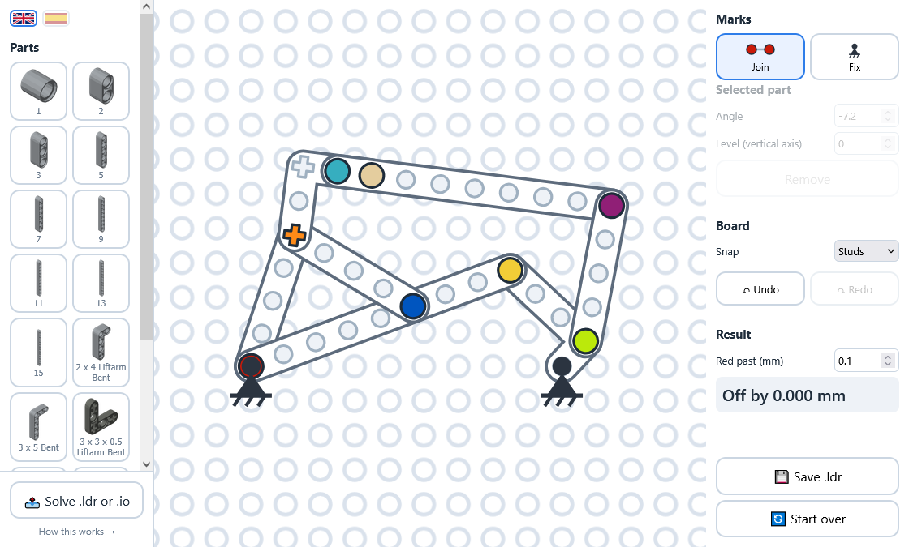

# [LEGO diagonal generator](https://donmerendolo.github.io/LEGO-diagonal-generator/)

<div align="center">
  <p float="left">
    
  </p>
</div>

Setting a diagonal by hand in Studio manually never ends up *perfect* and is tedious to do,
so this tool lets you mark which holes go together and rotates and moves the parts
automatically to the correct position.

## Two ways to use it

**Draw it [here](https://donmerendolo.github.io/LEGO-diagonal-generator/)**:
drop parts on the board, click which holes stay fixed and which holes go together,
and it solves as you go. When you're finished, you can save a `.ldr` you can import
to your Studio.

**Or build it in Studio**: lay the parts out roughly, drop marker pins in the holes
that have to meet, and hand the file over. That way any part in the LDraw library
works, and so do submodels. Either press **Solve .ldr or .io** in the web app, or:

```bash
deno run -A diagonal.js mymodel.ldr
```

**→ [How to mark a model up: TUTORIAL.md](TUTORIAL.md)**

## Running it

```bash
# solve a model
deno run -A diagonal.js mymodel.ldr

# check the math
deno run -A test.js

# the web app needs serving, ES modules will not load from file://
python -m http.server
```

Three generators rebuild what is derived from the LDraw library. Run them when you add
a part to the palette, or when the library is updated, or never.

```bash
deno run -A tools/parts.js      # parts.js — the palette's holes
deno run -A tools/pictures.js   # img/*.png — the palette's pictures
deno run -A tools/holes.js      # holes.js — every hole in the library, for the browser
```

## License

The code is [GPL-3.0](LICENSE.md).

`parts.js`, `holes.js` and everything in `img/` are generated from the
[LDraw parts library](https://www.ldraw.org), which is **CC BY 4.0**.

