# LEGO diagonal generator

This tutorial covers the CLI usage and upload of a `.ldr` or `.io` to LEGO diagonal
generator (button at the bottom left corner).

<p align="center">
  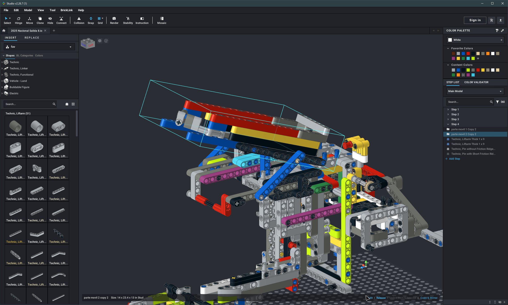
</p>

> The recommended workflow (which I use) is the following, but not the only one.

## Create submodels and place parts

### 1. Copy your current design into a new file inside a submodel

In my case, I copied this FLL attachment and put it inside a submodel:

<p align="center">
  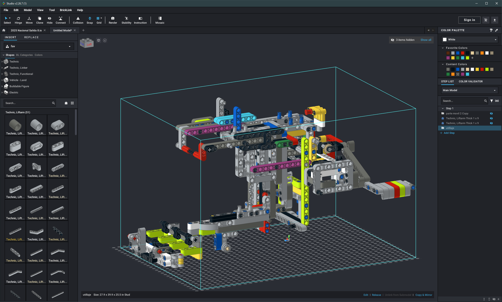
</p>

### 2. Now, if your design has parts that are fixed together, create a submodel with those parts

I created this submodel:

<p align="center">
  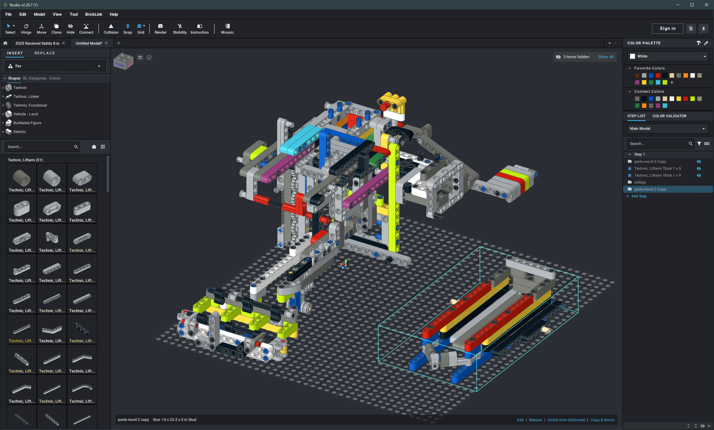
</p>

### 3. Place it in your design

The submodel I created rotates around that pin with respect to the rest of the
attachment.

<p align="center">
  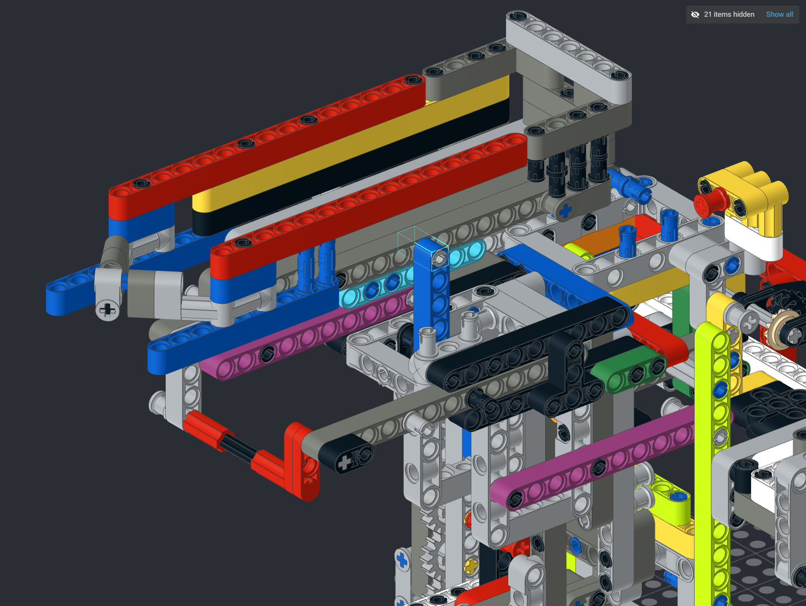
</p>

### 4. The other two parts at weird angles I want the tool to place are two 9L beams

<p align="center">
  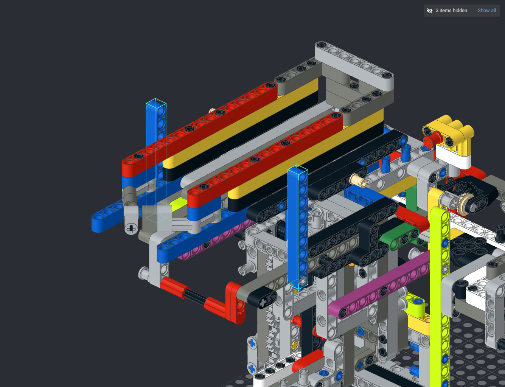
</p>

### 5. Remove the attachment so that only the submodel and the two beams remain

<p align="center">
  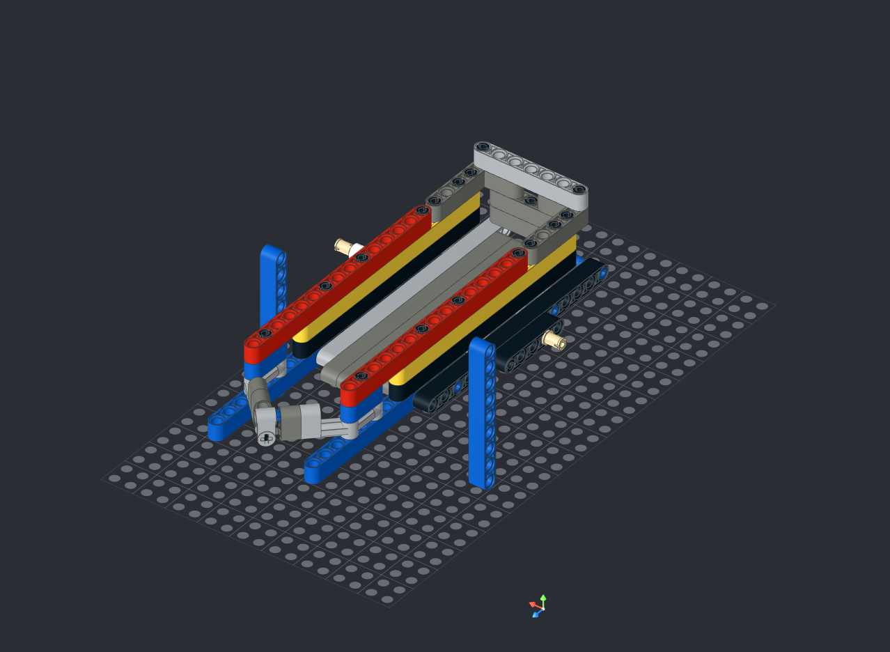
</p>

### 6. Place markers to indicate fixed points

Fix markers are `Technic, Axle 2L with Pin with Friction Ridges` (**18651**).

<p align="center">
  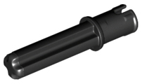
</p>

The fixed points in my design are these:

<p align="center">
  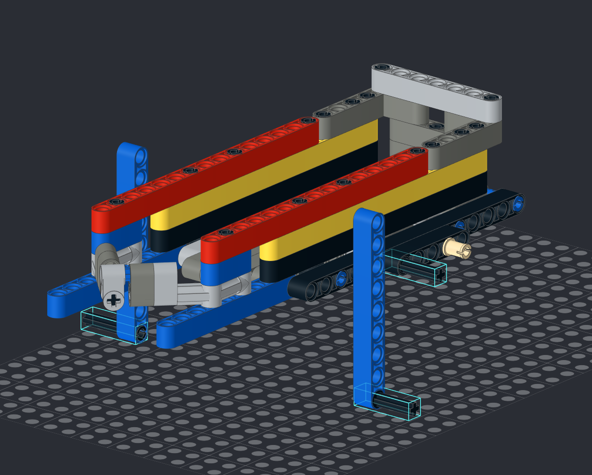
</p>

### 7. Place joint markers to indicate where your parts connect to each other

Joint markers are `Technic, Axle 1L with Pin without Friction Ridges with Round Hole` (**3749**).

<p align="center">
  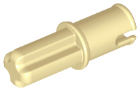
</p>

I placed my joint markers like this:

<p align="center">
  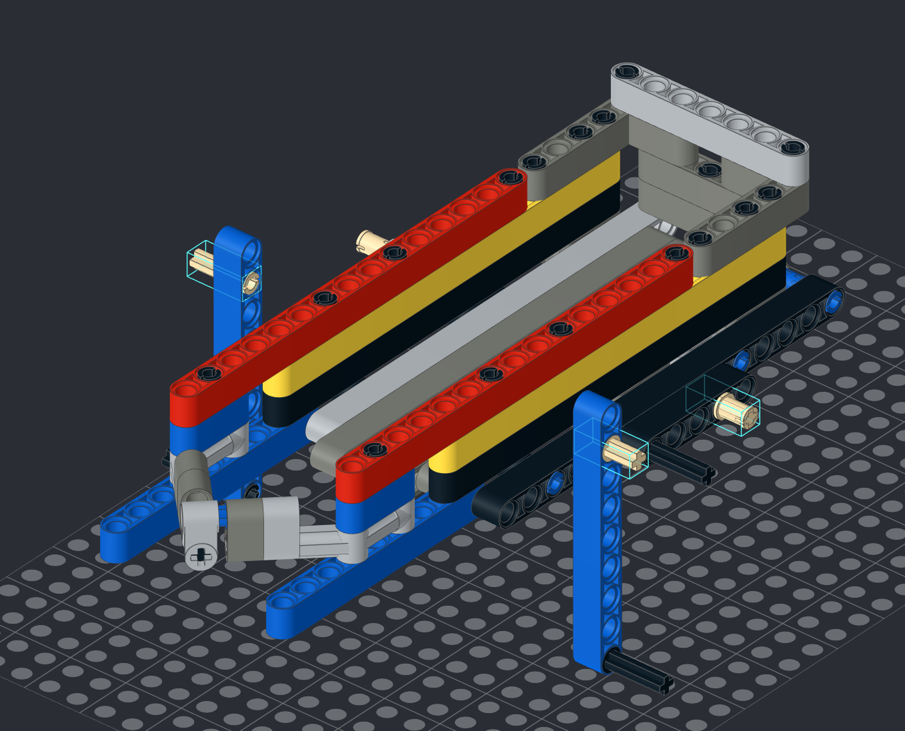
</p>

> [!IMPORTANT]
> If you need more than one joint, they are paired by color.
> **Two joint markers of the same color will be connected together.**

<p align="center">
  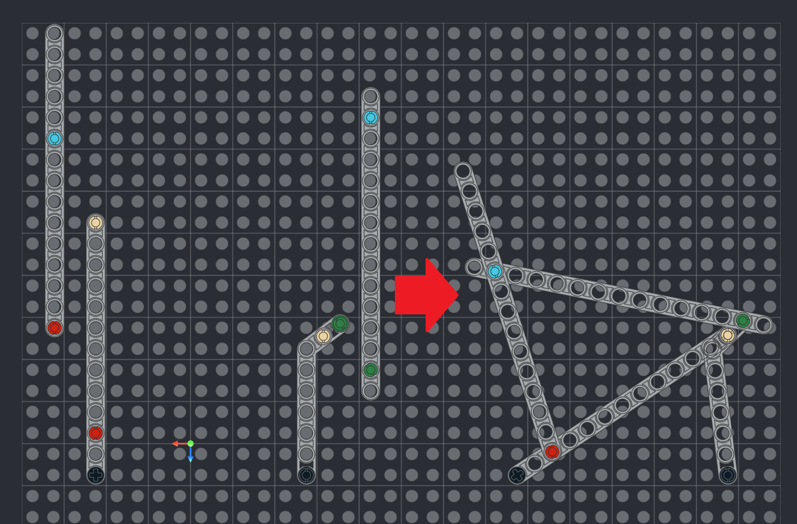
</p>

### 8. Rotate your model so that rotating axes are parallel to the vertical axis

<p align="center">
  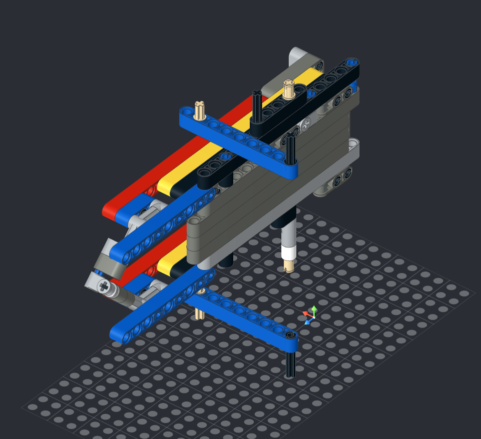
</p>

### 9. Process your design with LEGO diagonal generator

Either by uploading it to [the web app](https://donmerendolo.github.io/LEGO-diagonal-generator/)
or by using the CLI as follows (in the repo root):

```bash
deno run -A diagonal.js <your-file>.io
```

### 10. LEGO diagonal generator will generate a `<your-file>-solved.ldr` file with your parts perfectly positioned

Import it to your design and you are done!

<p align="center">
  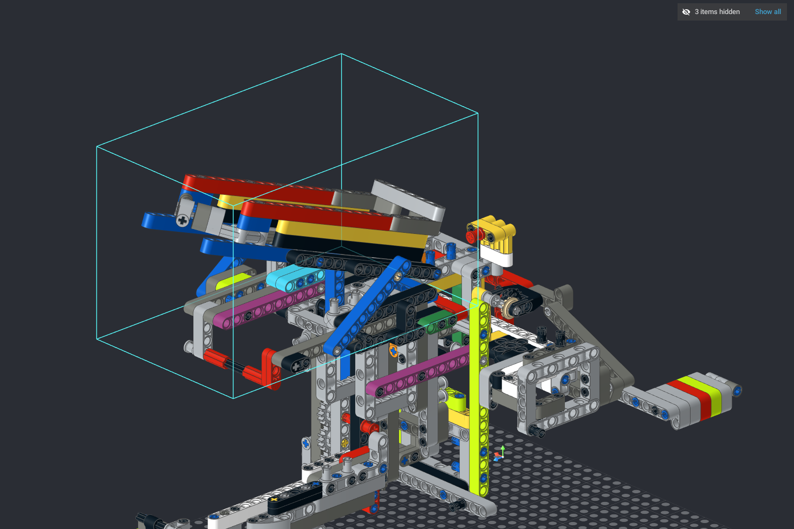
</p>

